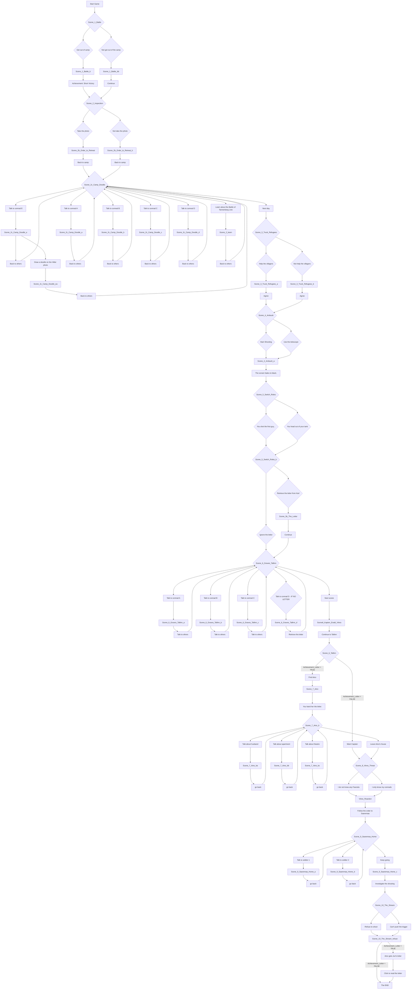

```mermaid
graph TD
    A[Start Game] --> Scene_1_Battle;

    %% Scene 1
    Scene_1_Battle{Scene_1_Battle} --> B{Get out of camp};
    Scene_1_Battle --> C{Not get out of the camp};

    B --> Scene_1_Battle_b;
    C --> Scene_1_Battle_bb;

    Scene_1_Battle_b --> D[Achievement: Short Victory];
    Scene_1_Battle_bb --> E[Continue];
    D --> Scene_2_Inspection;
    E --> Scene_2_Inspection;

    %% Scene 2
    Scene_2_Inspection{Scene_2_Inspection} --> F{Take the photo};
    Scene_2_Inspection --> G{Not take the photo};

    F --> Scene_2b_Order_to_Retreat;
    G --> Scene_2b_Order_to_Retreat_b;

    Scene_2b_Order_to_Retreat --> H[Back to camp];
    Scene_2b_Order_to_Retreat_b --> I[Back to camp];
    H --> Scene_2c_Camp_Doodle;
    I --> Scene_2c_Camp_Doodle;

    %% Scene 2c Camp Doodle
    Scene_2c_Camp_Doodle{Scene_2c_Camp_Doodle} --> J[Talk to comrad E];
    Scene_2c_Camp_Doodle --> K[Talk to comrad A];
    Scene_2c_Camp_Doodle --> L[Talk to comrad B];
    Scene_2c_Camp_Doodle --> M[Talk to comrad C];
    Scene_2c_Camp_Doodle --> N[Talk to comrad D];
    Scene_2c_Camp_Doodle --> O[Next day];
    Scene_2c_Camp_Doodle --> P[Learn about the Battle of Tannenberg Line];

    J --> Scene_2c_Camp_Doodle_e;
    K --> Scene_2c_Camp_Doodle_a;
    L --> Scene_2c_Camp_Doodle_b;
    M --> Scene_2c_Camp_Doodle_c;
    N --> Scene_2c_Camp_Doodle_d;
    O --> Scene_3_Truck_Refugees;
    P --> Scene_2_learn;

    Scene_2c_Camp_Doodle_e --> Q[Back to others];
    Scene_2c_Camp_Doodle_e --> R[Draw a doodle on the Hitler photo];
    Q --> Scene_2c_Camp_Doodle;
    R --> Scene_2c_Camp_Doodle_ea;
    Scene_2c_Camp_Doodle_ea --> S[Back to others];
    S --> Scene_2c_Camp_Doodle;

    Scene_2c_Camp_Doodle_a --> T[Back to others];
    Scene_2c_Camp_Doodle_b --> U[Back to others];
    Scene_2c_Camp_Doodle_c --> V[Back to others];
    Scene_2c_Camp_Doodle_d --> W[Back to others];
    T --> Scene_2c_Camp_Doodle;
    U --> Scene_2c_Camp_Doodle;
    V --> Scene_2c_Camp_Doodle;
    W --> Scene_2c_Camp_Doodle;
    Scene_2_learn --> X[Back to others];
    X --> Scene_2c_Camp_Doodle;

    %% Scene 3 & 4
    Scene_3_Truck_Refugees{Scene_3_Truck_Refugees} --> Y{Help the villagers};
    Scene_3_Truck_Refugees --> Z{Not help the villagers};

    Y --> Scene_3_Truck_Refugees_a;
    Z --> Scene_3_Truck_Refugees_b;

    Scene_3_Truck_Refugees_a --> AA[Agree];
    Scene_3_Truck_Refugees_b --> AB[Agree];
    AA --> Scene_4_Ambush;
    AB --> Scene_4_Ambush;

    Scene_4_Ambush{Scene_4_Ambush} --> AC{Start Shooting};
    Scene_4_Ambush --> AD{Use the telescope};
    AC --> Scene_4_Ambush_a;
    AD --> Scene_4_Ambush_a;

    Scene_4_Ambush_a --> AE[The screen fades to black.];
    AE --> Scene_5_Switch_Roles;

    %% Scene 5
    Scene_5_Switch_Roles{Scene_5_Switch_Roles} --> AF{You shot the first guy...};
    Scene_5_Switch_Roles --> AG{You head out of your tank};
    AF --> Scene_5_Switch_Roles_b;
    AG --> Scene_5_Switch_Roles_b;

    Scene_5_Switch_Roles_b{Scene_5_Switch_Roles_b} --> AH{Retrieve the letter from Karl};
    Scene_5_Switch_Roles_b --> AI{Ignore the letter};

    AH --> Scene_5b_The_Letter;
    AI --> Scene_6_Graves_Tallinn;

    Scene_5b_The_Letter --> AJ[Continue];
    AJ --> Scene_6_Graves_Tallinn;

    %% Scene 6 Graves - Conditional Path for 'Comrad D'
    Scene_6_Graves_Tallinn{Scene_6_Graves_Tallinn} --> AK[Talk to comrad A];
    Scene_6_Graves_Tallinn --> AL[Talk to comrad B];
    Scene_6_Graves_Tallinn --> AM[Talk to comrad C];
    Scene_6_Graves_Tallinn --> AN{Talk to comrad D - IF NO LETTER}; 
    Scene_6_Graves_Tallinn --> AO[Next scene];

    AK --> Scene_6_Graves_Tallinn_a;
    AL --> Scene_6_Graves_Tallinn_b;
    AM --> Scene_6_Graves_Tallinn_c;
    AN --> Scene_6_Graves_Tallinn_d;
    AO --> Scene6_Kapten_Evald_Viires;

    Scene_6_Graves_Tallinn_a --> AP[Talk to others];
    Scene_6_Graves_Tallinn_b --> AQ[Talk to others];
    Scene_6_Graves_Tallinn_c --> AR[Talk to others];
    AP --> Scene_6_Graves_Tallinn;
    AQ --> Scene_6_Graves_Tallinn;
    AR --> Scene_6_Graves_Tallinn;

    Scene_6_Graves_Tallinn_d --> AS[Retrieve the letter];
    AS --> Scene_6_Graves_Tallinn;

    Scene6_Kapten_Evald_Viires --> AT[Continue to Tallinn];
    AT --> Scene_6_Tallinn;

    %% Scene 6 Tallinn & Scene 7 - Conditional Split
    Scene_6_Tallinn{Scene_6_Tallinn} -- Achievement_Letter = TRUE --> AU[Find Aino]; 
    Scene_6_Tallinn -- Achievement_Letter = FALSE --> AV[Meet Captain]; 

    AU --> Scene_7_Aino;
    AV --> Scene_8_Viires_Threat;

    Scene_7_Aino --> AW[You hand her the letter.];
    AW --> Scene_7_Aino_b;

    Scene_7_Aino_b{Scene_7_Aino_b} --> AX[Talk about husband];
    Scene_7_Aino_b --> AY[Talk about apartment];
    Scene_7_Aino_b --> AZ[Talk about theatre];
    Scene_7_Aino_b --> BA[Leave Aino's house];

    AX --> Scene_7_Aino_ba;
    AY --> Scene_7_Aino_bb;
    AZ --> Scene_7_Aino_bc;
    BA --> Scene_8_Viires_Threat;

    Scene_7_Aino_ba --> BB[go back];
    Scene_7_Aino_bb --> BC[go back];
    Scene_7_Aino_bc --> BD[go back];
    BB --> Scene_7_Aino_b;
    BC --> Scene_7_Aino_b;
    BD --> Scene_7_Aino_b;

    %% Scene 8
    Scene_8_Viires_Threat{Scene_8_Viires_Threat} --> BE[I do not know any Fascists];
    Scene_8_Viires_Threat --> BF[I only know my comrads];

    BE --> Viires_Reaction;
    BF --> Viires_Reaction;

    Viires_Reaction --> BG[Follow the order to Saaremaa];
    BG --> Scene_9_Saaremaa_Home;

    %% Scene 9 & 10
    Scene_9_Saaremaa_Home{Scene_9_Saaremaa_Home} --> BH[Talk to soldier 1];
    Scene_9_Saaremaa_Home --> BI[Talk to soldier 2];
    Scene_9_Saaremaa_Home --> BJ[Keep going];

    BH --> Scene_9_Saaremaa_Home_a;
    BI --> Scene_9_Saaremaa_Home_b;
    BJ --> Scene_9_Saaremaa_Home_c;

    Scene_9_Saaremaa_Home_a --> BK[go back];
    Scene_9_Saaremaa_Home_b --> BL[go back];
    BK --> Scene_9_Saaremaa_Home;
    BL --> Scene_9_Saaremaa_Home;

    Scene_9_Saaremaa_Home_c --> BM[Investigate the shouting];
    BM --> Scene_10_The_Stream;

    Scene_10_The_Stream{Scene_10_The_Stream} --> BN[Refuse to shoot];
    Scene_10_The_Stream --> BO[Can't push the trigger];

    BN --> Scene_10_The_Stream_refuse;
    BO --> Scene_10_The_Stream_refuse;

    %% Final Endings - Conditional Split
    Scene_10_The_Stream_refuse -- Achievement_Letter = TRUE --> Ending_Scene;
    Scene_10_The_Stream_refuse -- Achievement_Letter = FALSE --> Conclusion; 

    Ending_Scene[Aino gets Juri's letter] --> BR[Click to read the letter];
    BR --> Conclusion[The END];
```